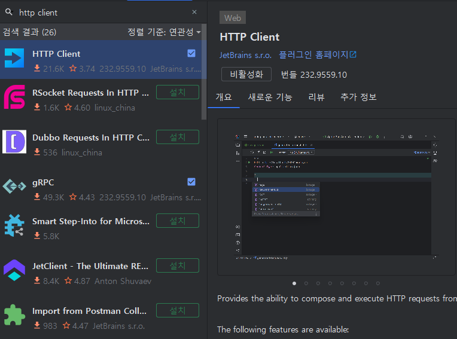
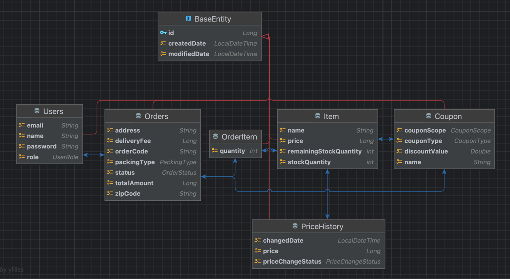

## 📅 일정

- `2023-08-14` ~ `2023-08-21`

------

### 실행 방법

1. **프로젝트 클론하기**
   ```bash
   git clone https://github.com/whale0928/aswemake-api-task.git
   ```

2 **프로젝트 실행**

   ```bash
    ./gradlew bootRun
   ```

3. **Http Client 설치 및 실행**
   > Http Client는 API를 테스트하고 검증하기 위한 도구로, 인텔리제이 IDE에 내장된 기능입니다.<br>
   API 요청을 보내고 응답을 확인할 수 있으며, GUI 환경에서 쉽게 사용할 수 있습니다.<br>
    - **인텔리제이 번들 패키지에 포함된 Http Client 사용하기**
        - 인텔리제이를 실행한 후, 오른쪽 하단의 `Http Client`를 클릭합니다.
        - 

4 **API 검증 및 테스트**

- `resources/https/` 경로에 있는 파일들을 Http Client에서 열어 API 검증 및 테스트를 진행합니다.

------

### API 명세

#### [REST_DOCS 링크](https://whale0928.github.io/aswemake-api-task/)

- rest docs 를 이용한 api 명세서
- 테스트 기반으로 만들어진 API 엔드포인트 명세
- Github_Pages 를 이용하여 배포중입니다.

----

### 엔티티 설계


